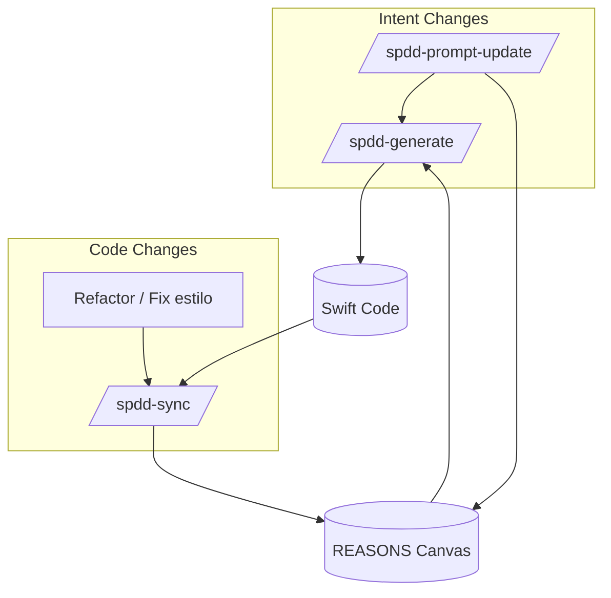

# SPDD Workflow — CrossfitPR

Guia operacional de [Structured-Prompt-Driven Development](https://martinfowler.com/articles/structured-prompt-driven/) para este projeto.

## Por que SPDD aqui?

CrossfitPR combina lógica de negócio (PRs, insights, gating PRO), arquitetura modular SPM e evolução contínua assistida por AI. SPDD torna as mudanças **governáveis, revisáveis e reutilizáveis** — a intenção fica explícita nos prompts versionados antes de qualquer código.

Implementação Swift segue a skill **iOS** em par com SPDD (ver [AGENTS.md](../AGENTS.md)).

## REASONS Canvas — mapa do sistema

Todo o design do app é expresso nas 7 dimensões REASONS:

| Dimensão | O que modela no CrossfitPR |
|----------|---------------------------|
| **R** Requirements | Problema, DoD, acceptance criteria |
| **E** Entities | PR, Exercise, ActivityKind, WorkoutInsight, SubscriptionTier |
| **A** Approach | SPM, SwiftUI sem ViewModels, offline-first, PRO gating |
| **S** Structure | Pacotes, dependências, camadas |
| **O** Operations | Clients, repositories, views, engine |
| **N** Norms | Swift 6, sem ViewModels, Swift Testing |
| **S** Safeguards | Scope, proibições, governança prompt-first |

Canvas baseline: [`spdd/prompt/CPR-001-20260520-[Feat]-baseline-pr-tracking-and-insights.md`](../spdd/prompt/CPR-001-20260520-%5BFeat%5D-baseline-pr-tracking-and-insights.md)

## Workflow completo

### Passo 1 — User Story

Criar `spdd/stories/{ID}-{description}.md` com:

- Background, Business Value
- Scope In / Scope Out
- Acceptance Criteria (Given/When/Then)

### Passo 2 — Clarificar análise (humano)

Revisar story: core logic, scope boundaries, definition of done.

### Passo 3 — `/spdd-analysis`

Gera `spdd/analysis/{ID}-{TIMESTAMP}-[Analysis]-*.md`:

- Entidades existentes vs novas (REASONS E)
- Strategic direction + trade-offs
- Risks, edge cases, AC coverage

### Passo 4 — `/spdd-reasons-canvas`

Gera `spdd/prompt/{ID}-{TIMESTAMP}-[Feat]-*.md` com 7 seções REASONS.

**Revisar antes de gerar código** — foco em Abstraction First e Alignment.

### Passo 5 — `/spdd-generate`

Implementa código task-by-task conforme Operations.

**Antes de escrever Swift:** carregar `.cursor/skills/ios-development-skill/skill-ios.md` (em conformidade com Norms SPDD).

Verificar: arquitetura (S), lógica de negócio (R/O), scope (Safeguards).

### Passo 6 — Testes

Gerar/atualizar `spdd/prompt/{ID}-*-[Test]-*.md` e implementar com Swift Testing.

## Loops de feedback

| Situação | Ação |
|----------|------|
| PO mudou requisito | `/spdd-prompt-update` → `/spdd-generate` |
| Bug de lógica | `/spdd-prompt-update` → `/spdd-generate` (diff direcionado) |
| Refactor sem mudar comportamento | Refactor → `/spdd-sync` |
| Hotfix produção (urgente) | Fix direto → post-mortem → `/spdd-sync` ou nova story |

## Três skills essenciais (SPDD + iOS)

1. **Abstraction first** — design antes de gerar (REASONS E + A + S antes de O).
2. **Alignment** — lock intent antes de código (review do canvas).
3. **Iterative review** — loop controlado prompt ↔ code ↔ test.

### Skills do agente (par obrigatório)

| Skill | Caminho | Responsabilidade |
|-------|---------|------------------|
| SPDD | `.cursor/skills/crossfitpr-spdd/SKILL.md` | Intenção, canvas, governança |
| iOS | `.cursor/skills/ios-development-skill/skill-ios.md` | Swift 6, SwiftUI, testes |

Regras Cursor: `spdd-governance.mdc` + `ios-swift-development.mdc`

## Baseline sincronizado

O sistema atual foi documentado retroativamente via `/spdd-sync`:

- Canvas master: [`spdd/prompt/CPR-001-20260520-[Feat]-baseline-pr-tracking-and-insights.md`](../spdd/prompt/CPR-001-20260520-%5BFeat%5D-baseline-pr-tracking-and-insights.md)

Toda nova iteração (CPR-002, CPR-003...) parte deste baseline como contexto acumulado.

## Ferramentas

| Ferramenta | Uso |
|------------|-----|
| Skill SPDD | `.cursor/skills/crossfitpr-spdd/SKILL.md` |
| Skill iOS | `.cursor/skills/ios-development-skill/skill-ios.md` |
| Cursor rules | `.cursor/rules/spdd-governance.mdc`, `ios-swift-development.mdc` |
| Cursor commands | `.cursor/commands/spdd-*.md` |
| openspdd CLI (opcional) | [github.com/gszhangwei/open-spdd](https://github.com/gszhangwei/open-spdd) |

## Fitness para CrossfitPR

| Cenário | Rating | Notas |
|---------|--------|-------|
| Nova feature (insights, PRO, exercícios) | ★★★★★ | Lógica de negócio + constraints claros |
| Refactor entre pacotes SPM | ★★★★☆ | `/spdd-sync` mantém alinhamento |
| Hotfix produção | ★★☆☆☆ | Fix primeiro, sync depois |
| Spike exploratório UI | ★★☆☆☆ | Overhead SPDD não compensa |

## Referências

- [Structured-Prompt-Driven Development — Martin Fowler](https://martinfowler.com/articles/structured-prompt-driven/)
- [openspdd](https://github.com/gszhangwei/open-spdd)
- [`spdd/README.md`](../spdd/README.md)
- [`AGENTS.md`](../AGENTS.md)
