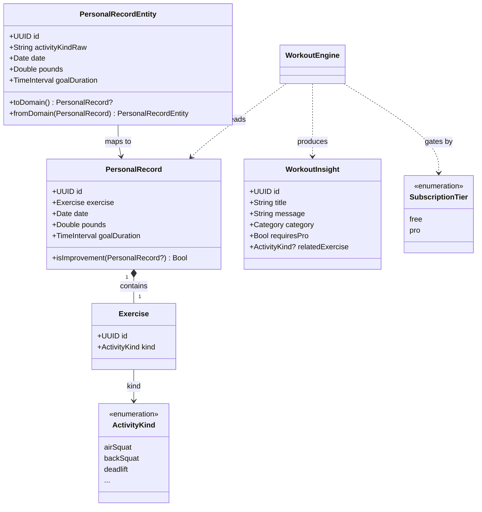

# CPR-001 — Baseline PR Tracking, Insights e Conversão PRO

> REASONS Canvas baseline — sincronizado via `/spdd-sync` em 2026-05-20 (CPR-003 + CPR-004).  
> Analysis: [`CPR-001-20260520-[Analysis]-baseline-pr-tracking-and-insights.md`](../analysis/CPR-001-20260520-%5BAnalysis%5D-baseline-pr-tracking-and-insights.md)

## Requirements

Implementar app iOS modular para registrar PRs de CrossFit, persistir offline com sync iCloud, gerar insights de evolução de treinos e converter usuários Free em PRO via análises avançadas bloqueadas — com Definition of Done verificável pelos ACs da story CPR-001.

## Entities



**Linguagem de negócio (REASONS E):** PR, insight, **WorkoutEngine** (análise de estagnação/evolução), tier PRO.

## Approach

1. **Arquitetura modular SPM:**
   - `Domain` — entidades, value objects, ports (sem frameworks Apple).
   - `Persistence` — SwiftData + CloudKit (infra only).
   - `WorkoutEngine` — engine de insights (só Domain).
   - `Subscription` — tier Free/PRO + StoreKit 2 (CPR-002).
   - `Application` — clients + `AppEnvironment` (composition root).
   - Feature packages — views SwiftUI por feature (`PRHistory`, `Insights`, `PROUpgrade`, `Onboarding`).
   - App shell — `CrossfitPRApp` + `RootView`.

2. **UI (SwiftUI 2025):**
   - Sem ViewModels; `@Environment(Client.self)` para serviços.
   - `@State` + enum `ViewState` para estado local de cada tela.
   - `.task(id:)` para efeitos colaterais (fetch, analyze).

3. **Persistência offline-first:**
   - SwiftData como fonte local imediata.
   - CloudKit sync best-effort via `CompositePersonalRecordRepository`.
   - Falha de sync não impede save local.

4. **Monetização PRO:**
   - `SubscriptionTier.canAccess(ProFeature)` centraliza gating.
   - `WorkoutEngine` gera insights PRO completos ou teaser para free.
   - `PROUpgradeView` com StoreKit 2 real (CPR-002).

5. **Testes:**
   - Swift Testing (`import Testing`) em cada pacote SPM.
   - Cobertura: domínio, mapeamento, engine, subscription.

## Structure

### Pacotes SPM

```
Packages/
├── Domain/
├── Persistence/
├── Subscription/
├── WorkoutEngine/
├── Application/          # Clients + AppEnvironment
├── PRHistory/            # Feature: histórico + novo PR
├── Insights/             # Feature: insights de treino
├── PROUpgrade/           # Feature: upgrade PRO
└── Onboarding/           # Feature: onboarding
```

### App shell

```
CrossfitPR/
├── CrossfitPRApp.swift     → @main, AppEnvironment.make()
├── RootView.swift          → Onboarding + TabView
└── Configuration/
    └── Products.storekit   → StoreKit local config (CPR-002)
```

### Dependências

1. `CrossfitPRApp` → `AppEnvironment.make()` → inject clients via Environment.
2. Feature views → `PersonalRecordClient`, `WorkoutEngineClient`, `SubscriptionClient`.
3. `PersonalRecordClient` → `CompositePersonalRecordRepository`.
4. `CompositePersonalRecordRepository` → `SwiftDataPersonalRecordRepository` + `CloudKitPersonalRecordRepository`.
5. `WorkoutEngineClient` → `WorkoutEngine` + `SubscriptionClient` (composição em Application).

### Camadas

| Camada | Componentes |
|--------|-------------|
| Presentation | Feature packages + `RootView` |
| Application | `PersonalRecordClient`, `WorkoutEngineClient`, `SubscriptionClient`, `AppEnvironment` |
| Domain | Entities, Ports, `WorkoutInsightsProviding` |
| Infrastructure | SwiftData, CloudKit, StoreKit |

## Operations

### Package: Domain

#### Create ActivityKind — Entity (enum)
1. Responsibility: Identificador tipado de exercício CrossFit.
2. Attributes: `rawValue: String`, cases enumerados (airSquat, backSquat, deadlift, etc.).
3. Constraints: `.empty` reservado para estado inválido; excluído do catálogo selecionável.

#### Create PersonalRecord — Entity (principal)
1. Responsibility: PR de um exercício.
2. Attributes: `id`, `exercise`, `date`, `pounds`, `goalDuration`.
3. Methods:
   - `isImprovement(over: PersonalRecord?) -> Bool`
     - Logic: retorna true se não há anterior; false se exercício diferente; compara `pounds`.

#### Create PersonalRecordRepository — Port
1. Methods: `save`, `fetchAll`, `delete` (all async throws).

#### Create SubscriptionTier + ProFeature — Entities (enums)
1. Method: `canAccess(_ feature: ProFeature) -> Bool` — free só acessa `.basicInsights`.
2. PRO feature: `.workoutEngineAnalysis` — análise WorkoutEngine.

#### Create WorkoutInsight — Entity
1. Category cases: `.summary`, `.trend`, `.workoutEngine`, `.recommendation`, `.proTeaser`.

#### Create WorkoutInsightsProviding — Port
1. Method: `generateInsights(from: [PersonalRecord], tier: SubscriptionTier) async -> [WorkoutInsight]`.

### Package: Persistence

#### Create PersonalRecordEntity — SwiftData @Model
1. Mapping: `toDomain()`, `fromDomain(_:)`.
2. Constraint: rejeitar `ActivityKind.empty` no `toDomain()`.

#### Create SwiftDataPersonalRecordRepository
1. Methods: CRUD via `ModelContext`; sort by date descending.

#### Create CloudKitPersonalRecordRepository
1. Record type: `PersonalRecord`.
2. Fields: activity, date, pounds, goal (goalDuration).
3. Mapping: `PersonalRecord.makeCloudKitRecord`, `init?(cloudKitRecord:)`.

#### Create CompositePersonalRecordRepository
1. save: local first, then remote (catch sync errors silently).
2. fetchAll: local if non-empty; else fetch remote and hydrate local.

#### Create PersistenceFactory
1. `makeModelContainer(inMemory:)` — schema `[PersonalRecordEntity.self]`.
2. `makeRepository(modelContainer:)` — composite local + remote.

### Package: WorkoutEngine

#### Create WorkoutEngine — Domain Service
1. `generateInsights(from:tier:)`:
   - Empty records → insight "Comece seu histórico".
   - Always → `makeSummaryInsight`.
   - Free tier → basic trends + pro teaser (if pro insights exist).
   - PRO tier → full pro insights (WorkoutEngine, recommendations, consistency).
2. WorkoutEngine detection: últimos 3 PRs mesmo peso → insight `.workoutEngine`.

### Package: Application

#### Create PersonalRecordClient — @Observable @MainActor
1. Properties: `records`, `isLoading`, `lastError`.
2. Methods: `fetchRecords()`, `save(_:)`, `delete(_:)`.

#### Create WorkoutEngineClient — @Observable @MainActor
1. Properties: `insights`, `isAnalyzing`.
2. Method: `analyze(records:)` — reads tier from SubscriptionClient, calls engine.

#### Create AppEnvironment — Composition root
1. `make(subscriptionStore:)` — monta container, repos, clients.
2. `bootstrapServices()` — refresh tier, load product, observe transactions.

### Package: Subscription

#### Create SubscriptionClient — @Observable @MainActor
1. Properties: `currentTier`, `proProduct`.
2. Methods: `purchasePro()`, `loadProProduct()`, `refreshStatus()`, `restorePurchases()`, `observeTransactionUpdates()`.
3. StoreKit via `SubscriptionStoreProviding` (CPR-002).

### Feature packages

#### PRHistory — PRHistoriesListView, NewPRRecordView
1. ViewState: loading | loaded | error(String).
2. Sheet → `NewPRRecordView`; pull-to-refresh.

#### Insights — WorkoutInsightsView
1. `.task(id: records.count)` → analyze via `WorkoutEngineClient`.
2. PRO toolbar button for free users; sheet → `PROUpgradeView`.

#### PROUpgrade — PROUpgradeView
1. Lists ProFeature benefits; purchase via StoreKit 2.

#### Onboarding — OnboardingView
1. Welcome + offline-first message; callback `onContinue()`.

### App: CrossfitPR

#### Create CrossfitPRApp — @main
1. Init: `AppEnvironment.make()`.
2. Inject via `.environment()`: subscriptionClient, personalRecordClient, workoutEngineClient.
3. Attach `.modelContainer(modelContainer)`.
4. `.task`: `bootstrapServices()`.

#### Create RootView
1. `@AppStorage("hasCompletedOnboarding")` gates onboarding.
2. TabView: PRHistory + Insights (imports feature packages).

## Norms

1. **Sem ViewModels** — usar Environment clients + @State local.
2. **Swift 6** — `Sendable` em domain types; `@MainActor` em clients UI.
3. **Package boundaries** — Domain não importa Persistence/WorkoutEngine/Subscription; feature packages não importam Persistence diretamente.
4. **Naming** — Linguagem de negócio (REASONS E): PR, insight, WorkoutEngine, tier PRO.
5. **Views** — enum `ViewState` por tela; `EmptyStateView` para empty states; tokens `AppDesign`; views `public` em feature packages.
6. **Design** — layout, cores e navegação congelados (CPR-001); skill `design/skill-design.md`.
7. **Testes** — Swift Testing com `@Suite` e `@Test`; `#expect` assertions.
7. **Mapeamento** — sempre `toDomain()` / `fromDomain()` entre persistence e domain.
8. **SPDD** — toda feature nova exige story → analysis → REASONS canvas antes de código.

## Safeguards

1. **Functional:**
   - Não criar ViewModels ou reducers TCA-style.
   - Não importar SwiftUI/UIKit em `Packages/Domain`.
   - Não bloquear save local por falha CloudKit.
   - Sempre mostrar teaser PRO quando insights avançados existem e tier == free.

2. **Performance:**
   - Fetch local primeiro; remote apenas se local vazio.
   - Insights calculados on-demand, não em background contínuo.

3. **Security:**
   - CloudKit private database only.
   - Não expor dados sensíveis em logs.

4. **Data:**
   - `pounds >= 0`; rejeitar `ActivityKind.empty` em PRs persistidos.
   - UUID estável como CKRecord recordName.

5. **Scope:**
   - StoreKit 2 implementado em CPR-002 (não placeholder).
   - Não adicionar LLM externo neste baseline (roadmap CPR-005).
   - Não modificar pacotes não listados em Operations sem atualizar este canvas.
   - **Não alterar layout, cores, tabs ou navegação** durante refactors de arquitetura — ver `.cursor/skills/design/skill-design.md`.

6. **SPDD governance:**
   - Não editar código de lógica de negócio sem atualizar prompt primeiro.
   - Refactors estruturais devem ser sincronizados via `/spdd-sync`.
   - Commits de feature referenciam ID do canvas (ex.: CPR-001).

## Evolução pós-baseline

| ID | Mudança | Canvas |
|----|---------|--------|
| CPR-002 | StoreKit 2 real | [`CPR-002-20260520-[Feat]-storekit-pro-subscription.md`](CPR-002-20260520-%5BFeat%5D-storekit-pro-subscription.md) |
| CPR-003 | Camada Application | [`CPR-003-20260520-[Feat]-spm-application-layer.md`](CPR-003-20260520-%5BFeat%5D-spm-application-layer.md) |
| CPR-004 | Feature packages + WorkoutEngine | [`CPR-004-20260520-[Feat]-spm-feature-packages-workout-engine.md`](CPR-004-20260520-%5BFeat%5D-spm-feature-packages-workout-engine.md) |
