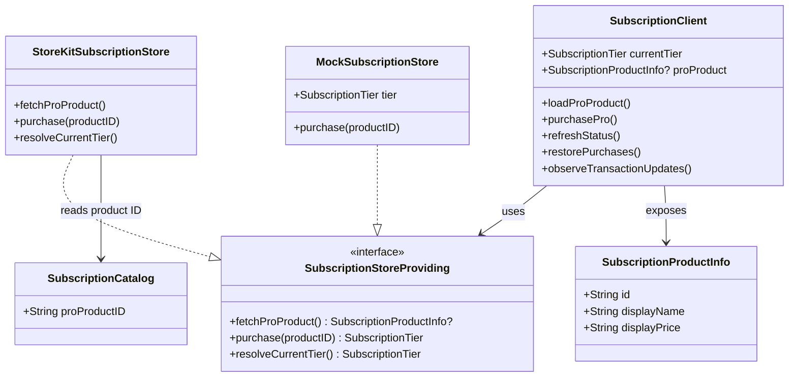

# CPR-002 — StoreKit 2 PRO Subscription

> Analysis: [`CPR-002-20260520-[Analysis]-storekit-pro-subscription.md`](../analysis/CPR-002-20260520-%5BAnalysis%5D-storekit-pro-subscription.md)

## Requirements

Integrar assinatura PRO real via StoreKit 2 — carregar produto, comprar, restaurar e sincronizar tier com entitlements Apple — substituindo placeholder de `purchasePro()`.

DoD: ACs 1–5 da story CPR-002 verificáveis.

## Entities



## Approach

1. **Domain ports** — `SubscriptionCatalog`, `SubscriptionProductInfo`, `SubscriptionStoreProviding`; extend `SubscriptionError`.
2. **StoreKit adapter** — `StoreKitSubscriptionStore` with Product.products, purchase, Transaction.currentEntitlements.
3. **DI** — `SubscriptionClient(store:)` defaults to `StoreKitSubscriptionStore()`; tests inject `MockSubscriptionStore`.
4. **UI** — `PROUpgradeView` shows price, restore button; silent cancel handling.
5. **App lifecycle** — refresh + transaction listener on launch.

## Structure

### Package changes

```
Packages/Domain/Sources/Domain/Subscription/
├── SubscriptionCatalog.swift          (NEW)
├── SubscriptionProductInfo.swift      (NEW)
├── SubscriptionStoreProviding.swift     (NEW)
└── SubscriptionStatusProviding.swift  (UPDATE errors)

Packages/Subscription/Sources/Subscription/
├── StoreKitSubscriptionStore.swift    (NEW)
├── MockSubscriptionStore.swift        (NEW)
└── SubscriptionClient.swift           (UPDATE)

CrossfitPR/
├── Configuration/Products.storekit     (NEW)
└── Packages/PROUpgrade/PROUpgradeView.swift  (UPDATE)
```

## Operations

### Domain — SubscriptionCatalog
1. `static let proProductID = "com.douglast.CrossfitPR.pro"`

### Domain — SubscriptionProductInfo
1. Struct Sendable: `id`, `displayName`, `displayPrice`

### Domain — SubscriptionStoreProviding (port)
1. `fetchProProduct() async throws -> SubscriptionProductInfo?`
2. `purchase(productID: String) async throws -> SubscriptionTier`
3. `resolveCurrentTier() async -> SubscriptionTier`

### Domain — SubscriptionError (extend)
1. Add: `userCancelled`, `pending`
2. Conform `Equatable`

### Subscription — StoreKitSubscriptionStore
1. `fetchProProduct`: Product.products → map to SubscriptionProductInfo
2. `purchase`: Product.purchase → verify → finish → return .pro
3. `resolveCurrentTier`: iterate Transaction.currentEntitlements for proProductID
4. Private `checkVerified(VerificationResult<T>)`

### Subscription — MockSubscriptionStore
1. Configurable `tier`, `product`, `shouldFailPurchase`, `shouldThrowCancelled`
2. Implements port for unit tests

### Subscription — SubscriptionClient (refactor)
1. Inject `store: any SubscriptionStoreProviding`
2. Add `proProduct: SubscriptionProductInfo?`, `isLoadingProduct`
3. `loadProProduct()` — fetch and cache product
4. `purchasePro()` — delegate to store; update currentTier
5. `refreshStatus()` — `currentTier = await store.resolveCurrentTier()`
6. `restorePurchases()` — refreshStatus only
7. `observeTransactionUpdates()` — Task listening Transaction.updates → refreshStatus

### App — CrossfitPRApp
1. `.task`: await refreshStatus(), loadProProduct(), observeTransactionUpdates()

### App — PROUpgradeView (pacote PROUpgrade)
1. `.task`: loadProProduct if nil
2. Display product displayPrice or fallback text
3. Button "Restaurar compras" → restorePurchases()
4. purchase(): catch userCancelled → no error message

### App — Products.storekit
1. Auto-renewable subscription `com.douglast.CrossfitPR.pro`

## Norms

1. StoreKit imports only in `Subscription` package — not Domain.
2. Tests use `MockSubscriptionStore` — never real StoreKit.
3. SPDD: update this canvas via `/spdd-sync` after implementation.
4. Swift 6, @MainActor on SubscriptionClient.

## Safeguards

1. Do not change WorkoutEngine gating logic.
2. Do not add ViewModels.
3. userCancelled must not show error alert.
4. Unverified transactions throw purchaseFailed — never grant PRO.
5. Scope limited to Subscription package + PROUpgradeView + CrossfitPRApp + storekit file.
