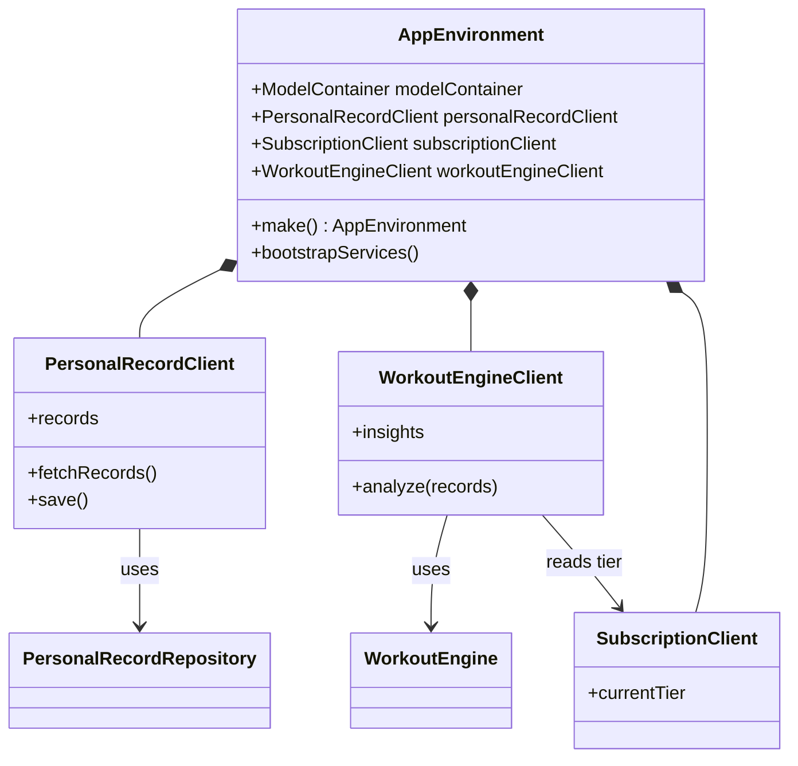

# CPR-003 — Camada Application e composition root

> Sincronizado via `/spdd-sync` retroativo em 2026-05-20.  
> Story: [`CPR-003-spm-application-layer.md`](../stories/CPR-003-spm-application-layer.md)

## Requirements

Isolar clients de aplicação e composition root em pacote `Application`, removendo acoplamentos laterais entre infra e engine — sem alterar layout ou fluxos de telas.

DoD: ACs 1–3 da story CPR-003.

## Entities



## Approach

1. Criar pacote `Application` como único ponto que importa Persistence + Subscription + WorkoutEngine.
2. Mover `PersonalRecordClient` de Persistence → Application.
3. Criar `WorkoutEngineClient` em Application (engine + tier).
4. `AppEnvironment.make()` substitui wiring manual em `CrossfitPRApp`.
5. Views continuam no app target nesta fase (extraídas em CPR-004).

## Structure

```
Packages/Application/
├── PersonalRecordClient.swift
├── WorkoutEngineClient.swift
└── AppEnvironment.swift

Packages/WorkoutEngine/     # só Domain — sem Subscription
Packages/Persistence/       # só repos + factory — sem clients
CrossfitPR/CrossfitPRApp.swift  # usa AppEnvironment.make()
```

### Grafo de dependências (pós-CPR-003)

```
Domain ← Persistence | Subscription | WorkoutEngine
              ↓
         Application
              ↓
         CrossfitPR App
```

## Operations

### Create Application package
1. `Package.swift` — deps: Domain, Persistence, Subscription, WorkoutEngine.

### Move PersonalRecordClient
1. De `Persistence` → `Application`.
2. Persistence expõe apenas repositories + `PersistenceFactory`.

### Create WorkoutEngineClient
1. Injeta `WorkoutEngine` + `SubscriptionClient`.
2. `analyze(records:)` lê tier e chama engine.

### Create AppEnvironment
1. `make(subscriptionStore:)` — monta container, repo, clients.
2. `bootstrapServices()` — refresh tier, load product, transaction listener.

### Update CrossfitPRApp
1. `try AppEnvironment.make()` no init.
2. Inject `workoutEngineClient` (nome final após CPR-004).

## Norms

1. Application é o **único** pacote que compõe infra + engine.
2. WorkoutEngine não importa Subscription.
3. UI inalterada nesta story.

## Safeguards

1. Não alterar layout/fluxos de telas.
2. Não mover views para SPM nesta story (CPR-004).
3. Manter testes em Application (`AppEnvironmentTests`).

## Evolução

- CPR-004 extrai views para feature packages e renomeia WorkoutAnalysis → WorkoutEngine.
